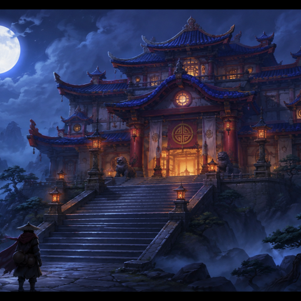
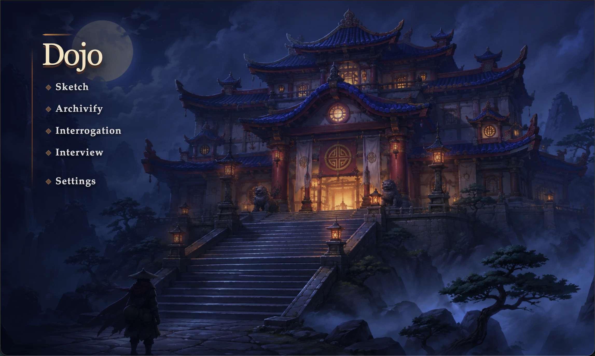
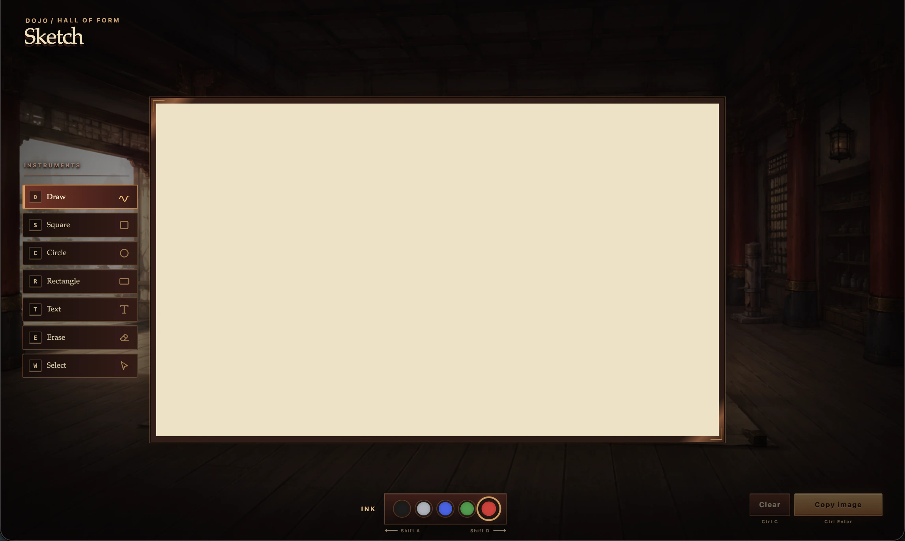
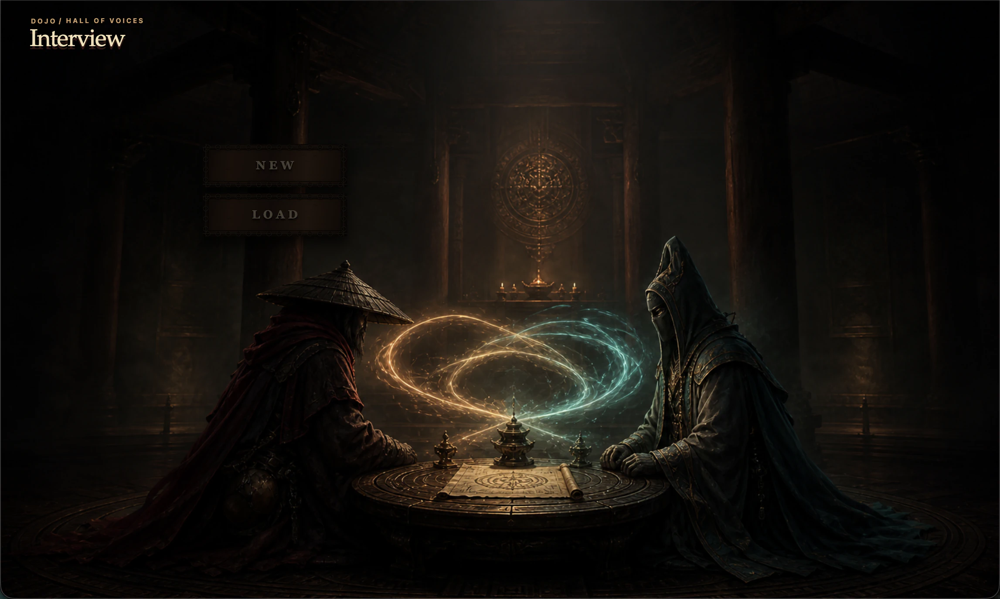
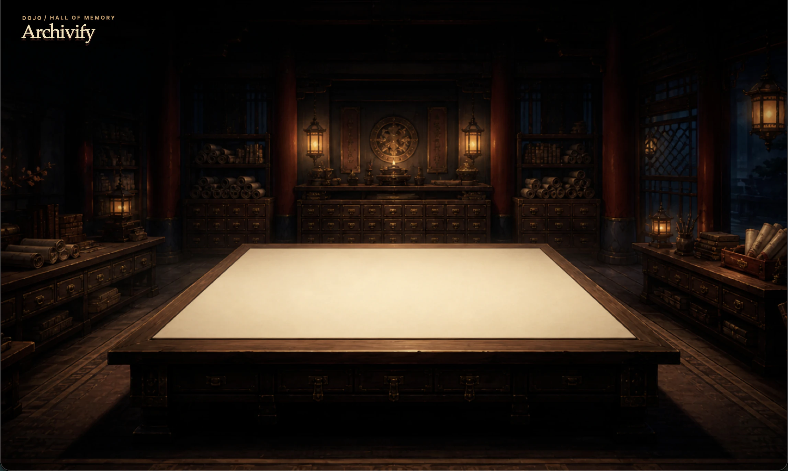
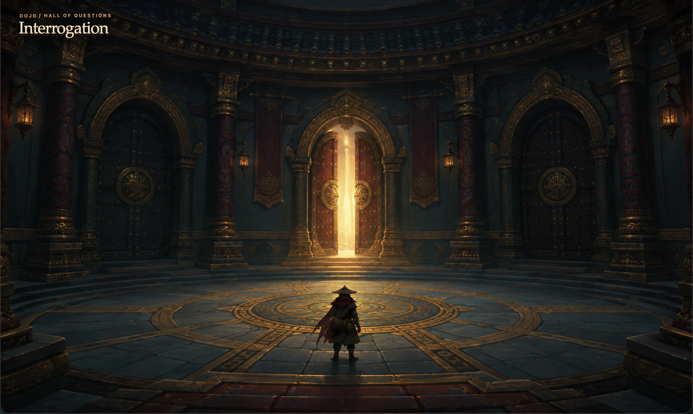
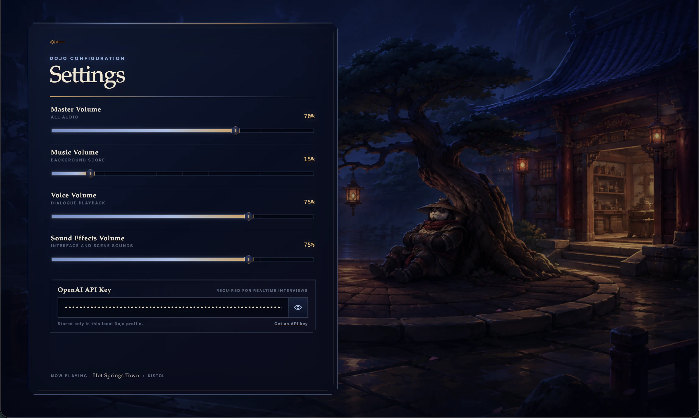

<p align="center">
  
</p>

<h1 align="center">
  Dojo<br>
  <sub><a href="https://dojo.bingo">dojo.bingo</a></sub>
  <br>
</h1>

<br>

<p>
  <strong>Dojo is a collection of specialized interfaces for getting what is in your head into a form that is maximally legible to an agent.</strong>
</p>

<p>
  It treats elicitation as an interface-design problem. Each room is shaped around a different way of thinking, with an emphasis on user legibility and throughput.
</p>

<p align="center">
  
</p>

> Dojo is early and under active development. Sketch and Interview work today; Archivify and Interrogation are visual shells for the workflows now being designed.

## Inside the Dojo

### Sketch / Hall of Form

Draw, arrange simple shapes, add text, and copy the result as an image for immediate use in an agent conversation.

<p align="center">
  
</p>

### Interview / Hall of Voices

Give a real-time voice interviewer an objective and supporting context. Dojo preserves the session locally, including its transcript, so it can be paused, resumed, searched, and copied.

<p align="center">
  
</p>

## Rooms in Development

<table>
  <tr>
    <td width="50%"></td>
    <td width="50%"></td>
  </tr>
  <tr>
    <td valign="top">
      <strong>Archivify / Hall of Memory</strong><br><br>
      AirDrop, upload, or paste photos of whiteboards, old notebooks, and other physical material; turn them into organized, agent-legible source material.
    </td>
    <td valign="top">
      <strong>Interrogation / Hall of Questions</strong><br><br>
      A user-first elicitation surface built around a small set of question formats, each optimized for legibility and response throughput.
    </td>
  </tr>
</table>

## Local Control

The Settings room keeps local controls explicit: soundtrack, sound effects, and the user-provided OpenAI API key required for voice interviews.

<p align="center">
  
</p>

## Direction

Dojo's intended home is the desktop. The browser-compatible build will be retired in favor of native capture and explicit agent-to-app communication.

- A CLI bridge will let agents open Interrogation as a richer question-and-answer surface, or prepare Interview with context retrieved from a personal wiki or codebase.
- Room-level SDKs will make each surface extensible: new Sketch tools, Interrogation formats, Archivify actions, and Interview real-time tools.

## Development

[Bun](https://bun.sh/) 1.3.14 or newer is required.

```sh
bun install
bun run dev
```

| Command | Purpose |
| --- | --- |
| `bun run dev` | Build the Electron main process and launch Dojo with the Vite renderer |
| `bun run check` | Run typechecking, linting, unit tests, and production builds |
| `bun run test:e2e` | Run browser and Electron end-to-end tests |
| `bun run package` | Create platform artifacts in `packages/desktop/release/` |

Voice interviews require an OpenAI API key entered in Settings. Distributing production builds that include Sketch requires a valid [tldraw license](https://tldraw.dev/pricing).

Dojo is built with [Electron](https://www.electronjs.org/), [Foldkit](https://github.com/foldkit/foldkit), [Effect](https://effect.website/), [tldraw](https://tldraw.dev/), and the [OpenAI Realtime API](https://platform.openai.com/docs/guides/realtime).
